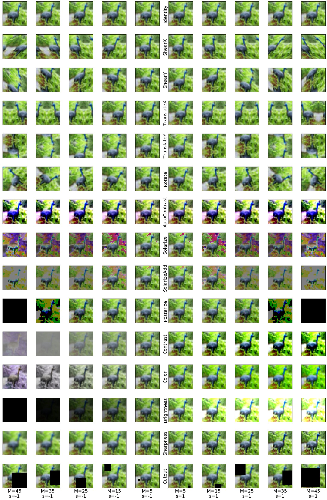

# Learnable test-time augmentation

In this repo we reproduce experiments from our paper ["Greedy Policy Search: A Simple Baseline for Learnable Test-Time Augmentation"](https://arxiv.org/abs/2002.09103) (UAI 2020) by Dmitry Molchanov, Alexander Lyzhov, Yuliya Molchanova, Arsenii Ashukha, Dmitry Vetrov.

<p align="center">

</p>

Test-time data augmentation&mdash;averaging the predictions of a machine learning model across multiple augmented samples of data&mdash;is a widely used technique that improves the predictive performance. While many advanced learnable data augmentation techniques have emerged in recent years, they are focused on the training phase. Such techniques are not necessarily optimal for test-time augmentation and can be outperformed by a policy consisting of simple crops and flips. The primary goal of this paper is to demonstrate that test-time augmentation policies can be successfully learned too. We introduce *greedy policy search* (GPS), a simple but high-performing method for learning a policy of test-time augmentation. We demonstrate that augmentation policies learned with GPS achieve superior predictive performance on image classification problems, provide better in-domain uncertainty estimation, and improve the robustness to domain shift. 

## Logs for the main results
Logs and notebooks are at [notebooks](notebooks) (unzip final-logs.zip), learned policies are at [policies](policies) (CIFAR) and [imagenet/trained_pols](imagenet/trained_pols) (ImageNet).

|Model | Central crop | Crop+flip | GPS |
|-------------|---------:|-------------:|-------------:|
|CIFAR-100 VGG16BN         | 78.1 | 81.3 | **82.1** |
|CIFAR-100 PreResNet110    | 81.7 | 83.2 | **83.5** |
|CIFAR-100 WideResNet28x10 | 84.1 | 85.5 | **86.4** |
|ImageNet ResNet50         | 79.2 | 80.6 | **80.9** |
|ImageNet EfficientNet B2  | 80.4 | 82.0 | **82.2** |
|ImageNet EfficientNet B5  | 83.8 | 84.5 | **84.6** |

## Environment setup
The following allows to create and to run a python environment with all required dependencies using [miniconda](https://docs.conda.io/en/latest/miniconda.html): 

```(bash)
conda env create -f condaenv.yml
conda activate megabayes
```

## Experiments on CIFARs

### Training with RandAugment
We trained `VGG16BN` on a single GPU, and `PreResNet110` and `WideResNet28x10` on two GPUs (multi-GPU support out of the box). Hyperparameters for CIFAR10 and CIFAR100 are the same.
In order to train with a fixed train-validation split, use flag `--valid_size 5000`.
```(bash)
ipython -- ./train/train_randaugment.py --dir=../augres --dataset=CIFAR10 --data_path=~/data --epochs=2000 --model=VGG16BN --lr_init=0.1 --wd=3e-4 --fname=CIFAR10-VGG16BN-randaugment --N 3 --M 45 --num_tta 1 --randaugment
ipython -- ./train/train_randaugment.py --dir=../augres --dataset=CIFAR10 --data_path=~/data --epochs=2000 --model=PreResNet110 --lr_init=0.1 --wd=3e-4 --fname=CIFAR10-PreResNet110-randaugment --N 3 --M 45 --num_tta 1 --randaugment
ipython -- ./train/train_randaugment.py --dir=../augres --dataset=CIFAR10 --data_path=~/data --epochs=2000 --model=WideResNet28x10 --lr_init=0.1 --wd=5e-4 --fname=CIFAR10-WideResNet28x10-randaugment --N 3 --M 45 --num_tta 1 --randaugment
```

### Creating a pool for policy search
To create a pool of augmentations for policy search, one would first need to extract the predictions using [`get_predictions_randaugment.py`](get_predictions_randaugment.py).
The model should be trained with a train-validation split (we use 5000 objects in a validation set for policy search).
We use 4 different magnitudes of augmentations: 500 samples with `M=45`, 500 samples with `M=20`, 100 samples with `M=0` (basic crop/flip augmentation) and one sample with no agumentation (central crop).
```(bash)
ipython -- get_predictions_randaugment.py --dataset=CIFAR10 --data_path ~/data --models ~/models/CIFAR10-VGG16BN-stratvalid.pt --fname Preds --N 3 --M 45 --log_dir validpreds --num_tta 500 --fix_sign --true_m0 --verbose --valid
ipython -- get_predictions_randaugment.py --dataset=CIFAR10 --data_path ~/data --models ~/models/CIFAR10-VGG16BN-stratvalid.pt --fname Preds --N 3 --M 20 --log_dir validpreds --num_tta 500 --fix_sign --true_m0 --verbose --valid
ipython -- get_predictions_randaugment.py --dataset=CIFAR10 --data_path ~/data --models ~/models/CIFAR10-VGG16BN-stratvalid.pt --fname Preds --N 3 --M 0 --log_dir validpreds --num_tta 100 --fix_sign --true_m0 --verbose --valid
ipython -- get_predictions_randaugment.py --dataset=CIFAR10 --data_path ~/data --models ~/models/CIFAR10-VGG16BN-stratvalid.pt --fname Preds --N 0 --M 0 --log_dir validpreds --num_tta 1 --fix_sign --true_m0 --verbose --no_tta --valid
```

### Finding a policy with GPS
Given a set of validation predictions, one can find the policy using the greedy policy search procedure using [`policy-search.py`](policy-search.py).
```(bash)
ipython -- policy-search.py --predictions_dir validpreds/ --output CIFAR10-VGG16BN.npz
```

### Evaluating the found policy
The found policy can be evaluated using [`get_predictions_randaugment.py`](get_predictions_randaugment.py).
```(bash)
ipython -- get_predictions_randaugment.py --dataset=CIFAR10 --data_path ~/data --models ~/models/CIFAR10-VGG16BN-randaugment.pt --fname Preds --log_dir logs --num_tta 100 --fix_sign --true_m0 --verbose --silent --policy CIFAR10-VGG16BN.npz
```

### Evaluating other methods
[`get_predictions_randaugment.py`](get_predictions_randaugment.py) can also be used to evaluate other baselines.
For example, in order to evaluate Deep Ensembles, just supply the `--models` argument with a list of models.
Different augmentations can be obtained by varying the parameters `--N` and `--M` of RandAugment, and flag `--no_tta` disables test-time augmentation.
See the list of the arguments of [`get_predictions_randaugment.py`](get_predictions_randaugment.py) for further details.

## Experiments on ImageNet 

### Preparing a pool of policies 

`--mode` stands for augmentation mode:
- `cc`: rescale and central crop (no augmentation is used)
- `cf`: conventional scale/crop/flip augmentation 
- `ra`: RandAugment with parameters N and M 
- `5c`: resize and five crop augmentation central crop and four corner crops
- `10c`: resize and ten crop augmentation (five crops, two flips each)

`--model` works with the folowing models:
- `resnet50`
- `efficientnet_b2`
- `tf_efficientnet_b5`
- `tf_efficientnet_l2_ns`
- `tf_efficientnet_l2_ns_475`

These models are pre-trained and will be loaded automatically. More info on these models can be found at [https://github.com/rwightman/pytorch-image-models](https://github.com/rwightman/pytorch-image-models).

```(bash)
ipython3 -- imagenet/get_preds_randaug_imagenet.py \
--model resnet50 --mode ra --N 2 --M 20 \
--num_samples 20 --batch_size 128 --fix_sign \
--logits_dir ./logits/ --log_dir ./logs/ \
--data_path ~/imagenet/raw-data --num_workers 10
```

### Finding a policy with GPS
`--select_by` states for metric that is optimized by the algorithm:
- `ll`: calibrated log-likelihood (cLL)
- `acc`: accuracy

cLL works better than conventional log-likelihood, to use conventional LL set `temp_scale` to `False`.

```(bash)
ipython -- imagenet/select_imagenet.py \
--model resnet50 --select_by ll --select_only 20 \
--num_workers 20 --logits_dir ./logits
```

### Evaluating the found policy
```(bash)
ipython -- imagenet/get_preds_randaug_imagenet.py \
--use_val --report_ens --num_samples 5 --fix_sign \
--data_path ~/imagenet/raw-data --batch_size 500  \
--model resnet50 --mode ra --policy imagenet/trained_pols/resnet50_ll.npy
```

## Out-of-domain uncertainty

### CIFARs
Folder `CIFAR-C` should contain folders `CIFAR-10-C`, `CIFAR-100-C`.
``` (bash)
ipython -- get_predictions_randaugment_ood.py --num_tta 100 \
--fix_sign --models models/CIFAR10-VGG16BN-randaugment.pt \
--policy trained_pols/CIFAR10-VGG16BN-M45-policy.npz \
--dataset CIFAR10 --data_path ~/CIFAR-C/
```

### ImageNet
`--corruptions` are indices of corruptions to evaluate policy on, check `ood_transforms` in https://github.com/da-molchanov/advanced-tta/blob/master/imagenet/utils_imagenet.py for the full list.
``` (bash)
ipython -- imagenet/get_preds_randaug_imagenet_ood.py \
--use_val --report_ens --num_tta 20 --fix_sign --model resnet50 \
--mode ra --batch_size 220 --ood_exp_name optimal_policy \
--policy imagenet/trained_pols/resnet50_ll.npy \
--corruptions 0 1 2 3 --data_path ~/ImageNetC/
```

## Our modifications to RandAugment
We have modified the original RandAugment training procedure to achieve better performance.
Most importantly, the [original implementation](https://github.com/tensorflow/tpu/blob/master/models/official/efficientnet/autoaugment.py) of RandAugment does not keep the semantics of the magnitude parameter `M`.
The effective magnitude of some transformations decreases in `M` or has some other non-monotonic dependency on `M` (see e.g. a [related issue](https://github.com/tensorflow/tpu/issues/614)).
We have modified the mapping from the magnitude parameter `M` to the actual transformations such that larger `M` would mean a larger augmentation intensity for all transformations, with `M=0` generally corresponding to no additional augmentations (with the exception of an occasional `AutoContrast` which does not have a magnitude).
For bidirectional transformations like `Brightness` or `Sharpness` the direction of the augmentation (e.g. make the image darker or brighter) is chosen at random (one can override it by setting `randomize_sign=False` in [`utils/randaugment.py`](utils/randaugment.py)).

We have also found that using mirror padding for geometric transformations like `Rotate` and `Shear` instead of the default black padding improves the stability of training, decreases the shift of the moments of the images (likely important for Batch Normalization layers) and results in overall better performance.
Also, longer training is crucial for learning with large-magnitude augmentations (we train for 2000 epochs with `N=3` and `M=45`).
We have also removed the `Invert` and `Equalize` transforms for CIFAR models since they did not provide a significant improvement on a validation set.

These modifications allowed us to significantly improve the perfromance of WideResNet28x10 on CIFAR-100:
|Model | CIFAR-10 | CIFAR-100 |
|-------------|---------:|-------------:|
|WideResNet28x10 + RandAugment (original)         | 97.3 | 83.3 |
|WideResNet28x10 + RandAugment (ours)             | **98.0** | **84.1** |

The samples for different magnitudes of our modification of RandAugment are presented below:
<p align="center">

</p>

## Citation
If you found our code or algorithm useful, please cite our paper:

```
@article{molchanov2020greedy,
  title={Greedy Policy Search: A Simple Baseline for Learnable Test-Time Augmentation},
  author={Molchanov, Dmitry and Lyzhov, Alexander and Molchanova, Yuliya and Ashukha, Arsenii and Vetrov, Dmitry},
  journal={arXiv preprint arXiv:2002.09103},
  year={2020}
}
```
